# Reinforcement Fine-Tuning Learning Repo

This repository contains small experiments for supervised and reinforcement fine-tuning concepts with LoRA, including:

- `sft-lora-lesson.ipynb`: a LoRA + SFT arithmetic lesson
- `rft-lora-lesson.ipynb`: a LoRA + GRPO arithmetic lesson
- `rft-lora-early-stopping.ipynb`: a GRPO + LoRA lesson with validation-based moving-average early stopping
- `rewards.py`: shared answer parsing and reward computations used by all three training notebooks
- `mlflow_tracking.py`: shared MLflow tracking helpers for notebook runs, configs, metrics, and artifacts
- `grpo-completion-exploration.ipynb`: a notebook for inspecting GRPO completion Parquet files
- `visualize_lora_model.ipynb`: a notebook for visualizing a PEFT LoRA checkpoint and reporting model, checkpoint, and training metadata
- `visualize_baseline_model.ipynb`: a notebook for visualizing the original base model before any LoRA adapters are applied

## Fine-Tuning Task

The training notebooks fine-tune a model on a simple arithmetic addition task. Given prompts such as `What is 9 + 3?`, the model is trained to respond in the exact format `<think>...</think><answer>...</answer>`, where the `<answer>` tag contains the correct sum.

The early stopping notebook uses the same task, but splits the data into train, validation, and test subsets so GRPO training can stop when held-out reward stops improving.

For details on how RFT works see [RFT Explanation document](./rft-explanation.md)

RFT uses three independent reward components: `format_reward` (`0.5`), `correctness_reward` (`1.0`), and `think_reward` (`1.0`). The think reward requires the first `<think>` block to contain exactly `x + y` or `What is x + y`, using the ordered operands from the prompt. The maximum current reward is `2.5`; SFT uses the same scoring only during evaluation.

## Best Evaluation Performance on the Task

### Best RFT and SFT Results on out-of-sample test dataset

| Method | Epochs | Before Training | After Training |
|---|---:|---|---|
| **RFT without early stopping** | 4 | Accuracy: 0/50 (0%)<br>Format: 0/50 (0%)<br>Reward: 0.000 | **Accuracy: 50/50 (100%)**<br>**Format: 50/50 (100%)**<br>**Reward: 1.500** |
| **RFT with early stopping** | 3 of 8 | Accuracy: 0/50 (0%)<br>Format: 0/50 (0%)<br>Reward: 0.000 | **Accuracy: 94/94 (100%)**<br>**Format: 94/94 (100%)**<br>**Reward: 1.500** |
| **SFT** | 1 | Accuracy: 0/50 (0%)<br>Format: 0/50 (0%)<br>Score: 0.000 | **Accuracy: 50/50 (100%)**<br>**Format: 50/50 (100%)**<br>**Score: 1.500** |

All three approaches achieved perfect post-training accuracy and format compliance. RFT with early stopping did so after 3 epochs and was evaluated on the largest test set.

The results above were recorded before `think_reward` was added and retain their original `1.5` scoring scale.

**SFT vs. RFT Trade-offs**

| Consideration | SFT | RFT using GRPO |
|---|---|---|
| Training signal | Requires correct example responses | Requires a reward function that can score generated responses |
| Data creation | Potentially expensive expert demonstrations | Can use prompts without target completions |
| Compute cost | Lower; one training pass per example | Higher; generates and scores multiple completions per prompt |
| Training stability | Generally predictable and stable | More sensitive to hyperparameters, sampling, and reward design |
| Behavior learned | Imitates the demonstrations | Directly optimizes measurable outcomes |
| Output flexibility | Limited by the quality and diversity of examples | Can discover successful outputs not present in demonstrations |
| Main risk | Memorization or imitation of flaws in the dataset | Reward hacking, unstable runs, or degraded behavior outside the reward |
| Best fit | Well-defined desired responses are available | Success is easy to verify, but ideal responses are hard to author |


## Requirements

- `uv`
- Homebrew Python 3.12 at `/opt/homebrew/bin/python3.12`

Note: this project is pinned to the resolved Homebrew interpreter path in `.python-version`:

`/opt/homebrew/opt/python@3.12/bin/python3.12`

## Setup With `uv`

1. Confirm the Python interpreter exists:

```bash
ls -l /opt/homebrew/bin/python3.12
```

2. Create or sync the virtual environment:

```bash
UV_CACHE_DIR=.uv-cache uv sync
```

This will create `.venv` and install the project dependencies from `pyproject.toml` / `uv.lock`.

## Using The Notebook

Open `sft-lora-lesson.ipynb`, `rft-lora-lesson.ipynb`, `rft-lora-early-stopping.ipynb`, `grpo-completion-exploration.ipynb`, `visualize_lora_model.ipynb`, or `visualize_baseline_model.ipynb` in your notebook editor and select the local kernel from `.venv`.

`rft-lora-early-stopping.ipynb` extends the basic GRPO lesson with:

- a train/validation/test split
- periodic evaluation during training
- a custom moving-average early stopping callback
- best-checkpoint reloading based on `smoothed_reward`

`grpo-completion-exploration.ipynb` reads a file from `grpo-arithmetic-lora-demo/completions` into a pandas DataFrame. Set `parquet_filename` at the top of the notebook to choose the file, and optionally change `records_to_show` to control how many records are rendered. The notebook prints the requested count, the total number of records in the file, and the number actually shown, then displays each record with the full `prompt` and `completion` text.

`visualize_lora_model.ipynb` loads a PEFT LoRA checkpoint such as `sft-arithmetic-lora-demo/checkpoint-19` or `grpo-arithmetic-lora-demo/checkpoint-72`, resolves the associated base model, applies the adapter, renders a `torchinfo` summary, and displays a report with parameter counts, LoRA metadata, and checkpoint/training details when available.

`visualize_baseline_model.ipynb` uses the same `checkpoint_dir` style input, but only to resolve `base_model_name_or_path`. It then loads the original baseline model without applying any LoRA adapter, renders a `torchinfo` summary, and reports baseline-only information such as parameter totals, dtype breakdown, and tokenizer details.

If your editor does not detect it automatically, use the Python interpreter at:

`/Users/jim/Desktop/genai/rft-learning/.venv/bin/python`

## Installed Dependencies

The project currently uses:

- `accelerate`
- `datasets`
- `ipykernel`
- `mlflow`
- `pandas`
- `peft`
- `pyarrow`
- `torchinfo`
- `transformers`
- `trl[peft]`

## Notes

- `sft-lora-lesson.ipynb` demonstrates supervised fine-tuning with known target completions.
- `rft-lora-early-stopping.ipynb` demonstrates validation-based GRPO training with moving-average early stopping and best-model selection.
- `grpo-completion-exploration.ipynb` is useful for inspecting saved GRPO completion samples after training.
- `visualize_lora_model.ipynb` is useful for inspecting saved PEFT LoRA checkpoints and their associated adapter/training metadata.
- `visualize_baseline_model.ipynb` is useful for inspecting the original base model referenced by a saved PEFT LoRA checkpoint.
- The three training notebooks create MLflow parent runs with child runs for baseline evaluation, training, and fine-tuned evaluation.
- The lesson currently depends on the `trl` API version installed in this repo.

## MLflow Tracking

The training notebooks use MLflow to capture:

- model identity and notebook type
- LoRA and trainer configuration
- dataset split sizes
- baseline evaluation metrics
- training metrics and training-history artifacts
- fine-tuned evaluation metrics and sample artifacts

By default, MLflow uses a local SQLite-backed tracking store at `./mlflow.db` and writes run artifacts to `./mlartifacts`, so no external server is required.

### Launch The UI

After running one or more training notebooks, start the MLflow UI from the repo root:

```bash
uv run mlflow ui
```

Then open the local URL shown by MLflow, typically `http://127.0.0.1:5000`.

### Run Layout

Each notebook execution creates:

- one parent run for the overall notebook execution
- one child run for `baseline_eval`
- one child run for `training`
- one child run for `fine_tuned_eval`

The parent run stores prefixed summary metrics such as `baseline.accuracy` and `fine_tuned.avg_reward`, while child runs hold phase-specific metrics, configs, and artifacts.

### Sample MLFlow Visualizations

**MLFlow Experiment Run Listing**
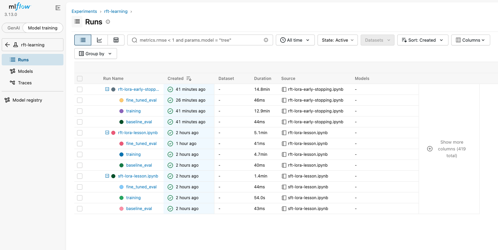

**Selecting Runs for Comparison**
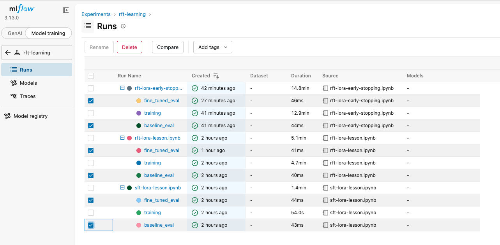

**Reward Values Before and After Fine-tuning**
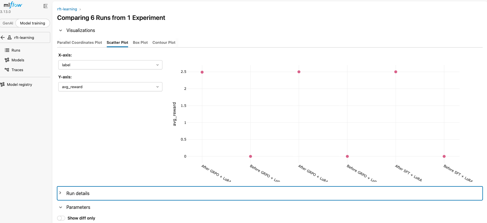

**Experiment Run Configurations**
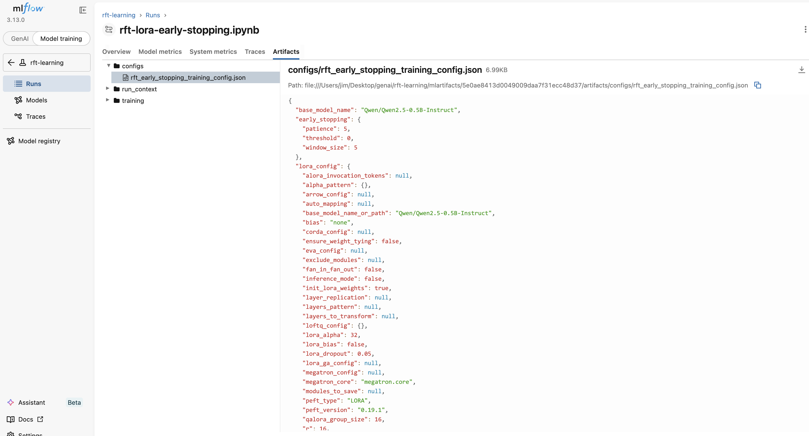

**Training History Data**
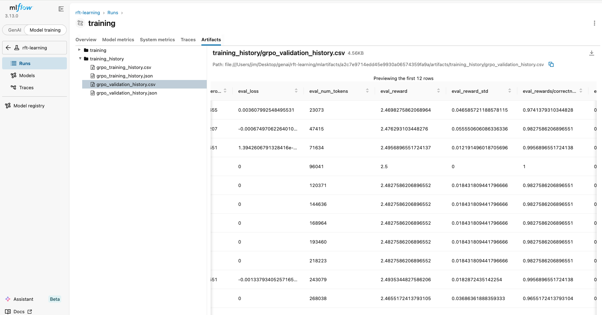

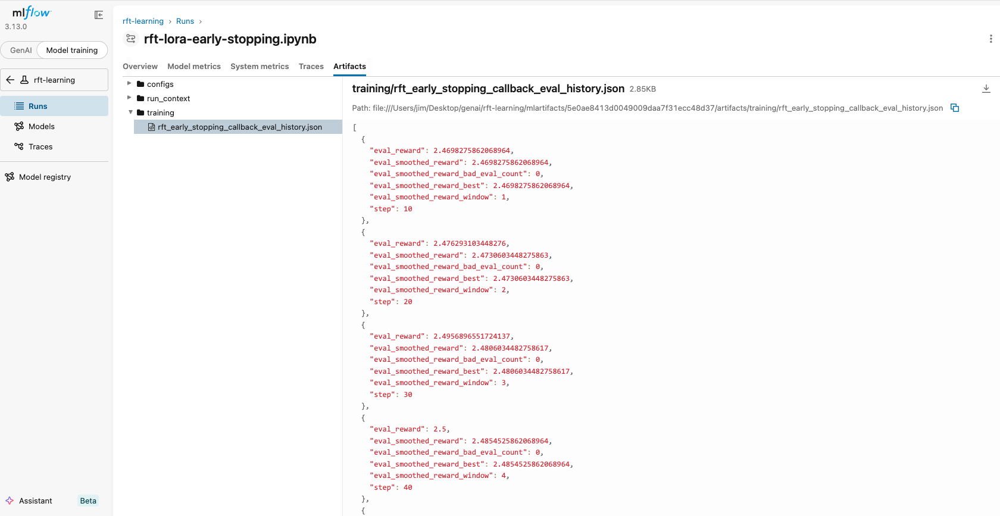


## Reproducibility (Deprecated Results - Kept for Historical Purposes - Current metrics are found in MLFlow)

Metrics from the out-of-sample test data set.

### Reinforcement Fine-Tuning (RFT)

#### Initial Test

```
lora_config = LoraConfig(
    task_type=TaskType.CAUSAL_LM,
    r=16,
    lora_alpha=32,
    lora_dropout=0.05,
    target_modules=[
        "q_proj",
        "v_proj",
        "o_proj",
        "gate_proj",
        "up_proj",
        "down_proj",
    ],
)
training_args = GRPOConfig(
    output_dir="grpo-arithmetic-lora-demo",
    per_device_train_batch_size=2,
    gradient_accumulation_steps=4,
    num_generations=4,
    max_completion_length=64,
    num_train_epochs=1,
    logging_steps=10,
    learning_rate=5e-5,
    log_completions=True,
)
```


|Model|epochs|Before RFT|After RFT|
|-----|:----:|----------|---------|
|Qwen2.5-0.5B-Instruct|1|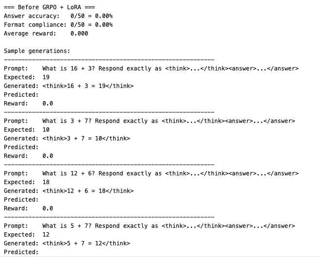|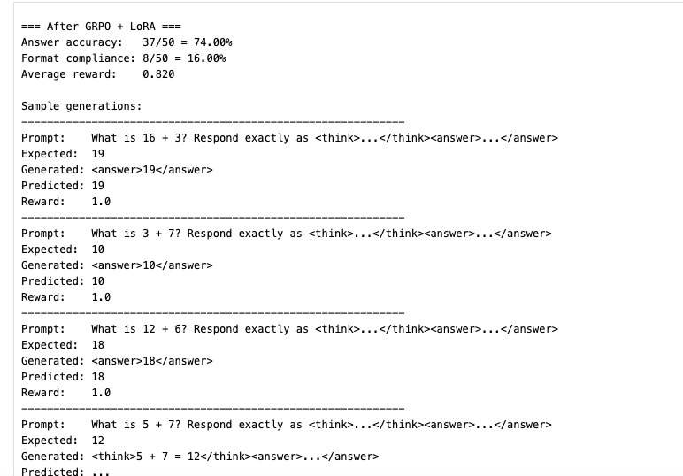|
|Qwen2.5-0.5B-Instruct|1||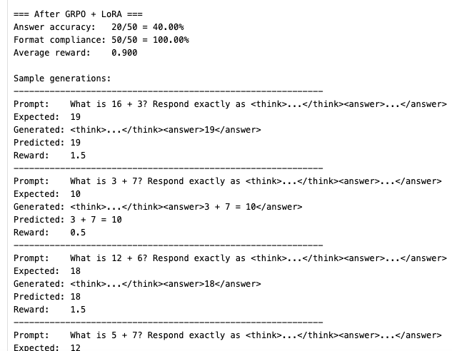|
|Qwen2.5-0.5B-Instruct|1||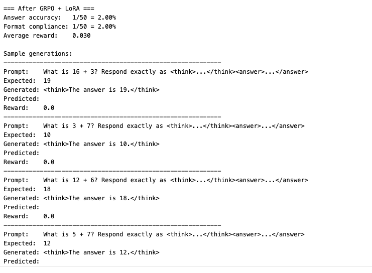|
|Qwen2.5-0.5B-Instruct|3||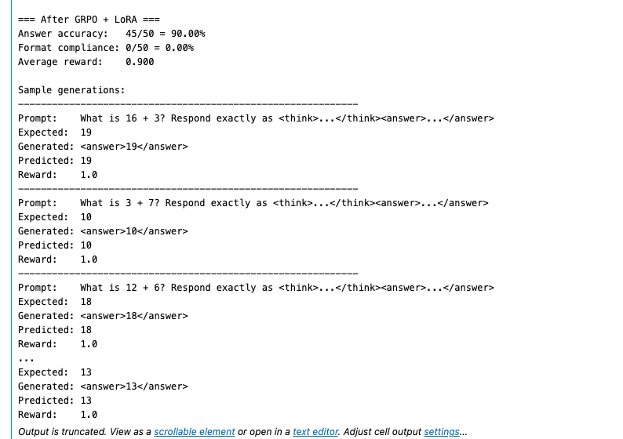|
|Qwen2.5-0.5B-Instruct|1||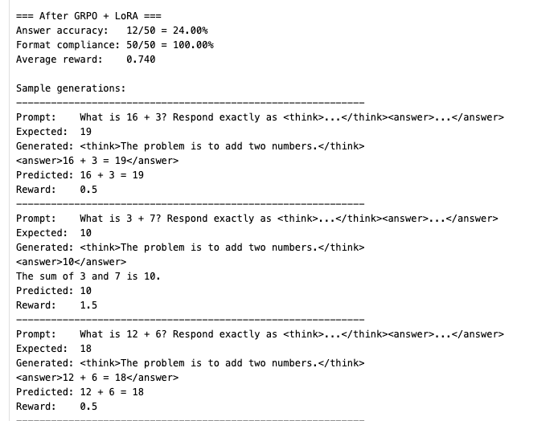|
|Qwen2.5-1.5B-Instruct|1|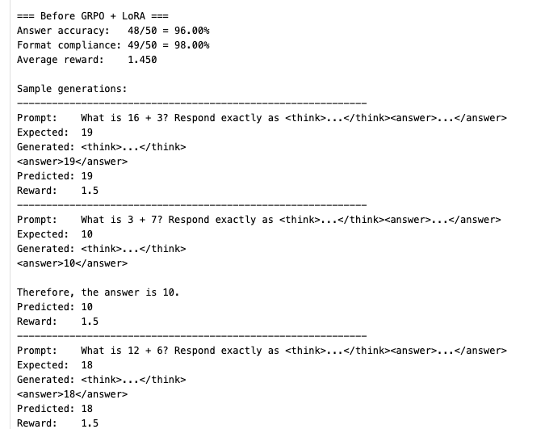|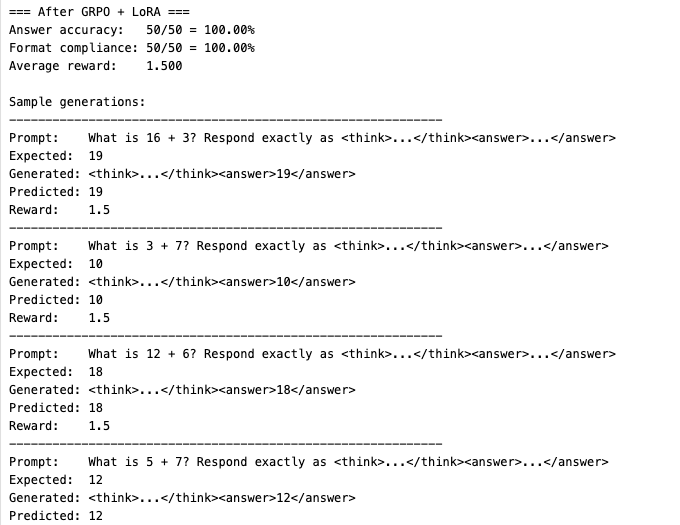|
|Qwen2.5-0.5B-Instruct|1||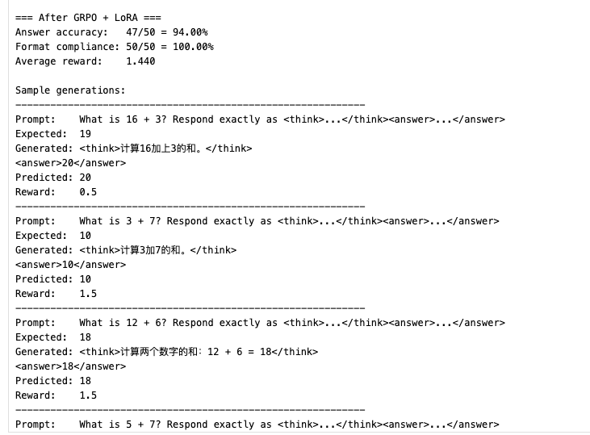|

#### Increased Batch Size & Epochs

```
lora_config = LoraConfig(
    task_type=TaskType.CAUSAL_LM,
    r=16,
    lora_alpha=32,
    lora_dropout=0.05,
    target_modules=[
        "q_proj",
        "v_proj",
        "o_proj",
        "gate_proj",
        "up_proj",
        "down_proj",
    ],
)
training_args = GRPOConfig(
    output_dir="grpo-arithmetic-lora-demo",
    per_device_train_batch_size=8,            <==
    gradient_accumulation_steps=4,
    num_generations=4,
    max_completion_length=64,
    num_train_epochs=4,                       <==
    logging_steps=10,
    learning_rate=5e-5,
    log_completions=True,
)
```

|Model|epochs|Before RFT|After RFT|
|-----|:----:|----------|---------|
|Qwen2.5-0.5B-Instruct|4||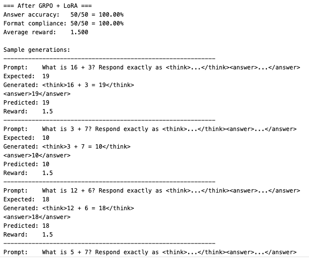|
|Qwen2.5-0.5B-Instruct|4||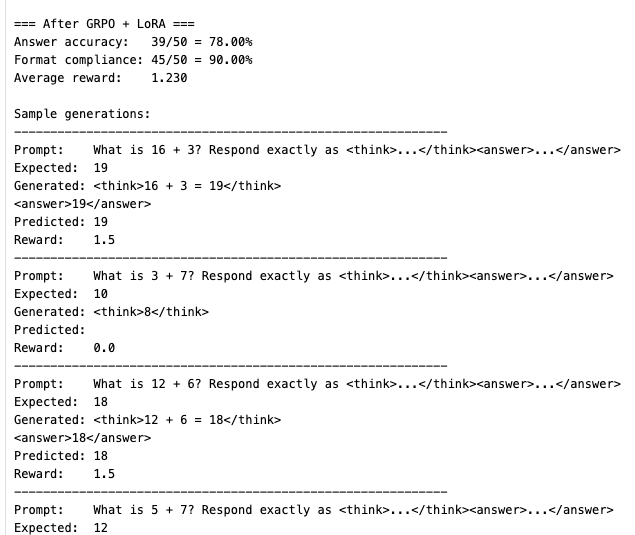|
|Qwen2.5-0.5B-Instruct|4||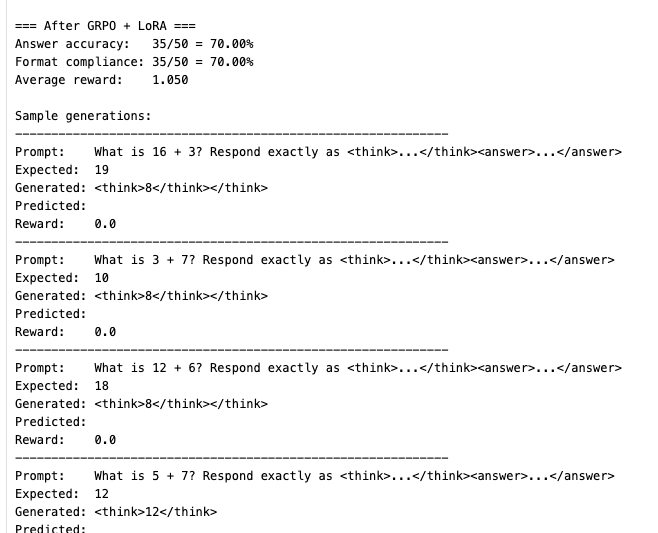|


#### Early Stopping

```
lora_config = LoraConfig(
    task_type=TaskType.CAUSAL_LM,
    r=16,
    lora_alpha=32,
    lora_dropout=0.05,
    target_modules=[
        "q_proj",
        "v_proj",
        "o_proj",
        "gate_proj",
        "up_proj",
        "down_proj",
    ],
)

moving_average_window = 5
early_stopping_patience = 5
early_stopping_threshold = 0.0

training_args = GRPOConfig(
    output_dir="grpo-arithmetic-lora-early-stopping-demo",
    per_device_train_batch_size=8,
    gradient_accumulation_steps=4,
    num_generations=4,
    num_generations_eval=4,
    max_completion_length=64,
    temperature=1.0,
    top_p=1.0,
    top_k=0,
    min_p=None,
    repetition_penalty=1.0,
    num_train_epochs=8,
    logging_steps=10,
    learning_rate=5e-5,
    log_completions=False, #True,
    eval_strategy="steps",
    eval_steps=10,
    save_strategy="steps",
    save_steps=10,
    load_best_model_at_end=True,
    metric_for_best_model="smoothed_reward",
    greater_is_better=True,
    save_total_limit=2,
)
```

|Model|Actual/Max epochs|Before RFT|After RFT|
|-----|:----:|----------|---------|
|Qwen2.5-0.5B-Instruct|3/8||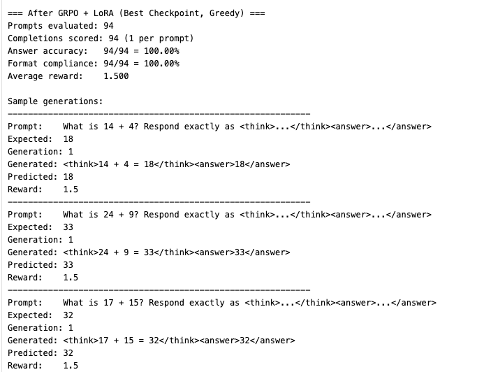|


### Supervised Fine-Tuning (SFT)

|Model|epochs|Before SFT|After SFT|
|-----|:----:|----------|---------|
|Qwen2.5-0.5B-Instruct|1|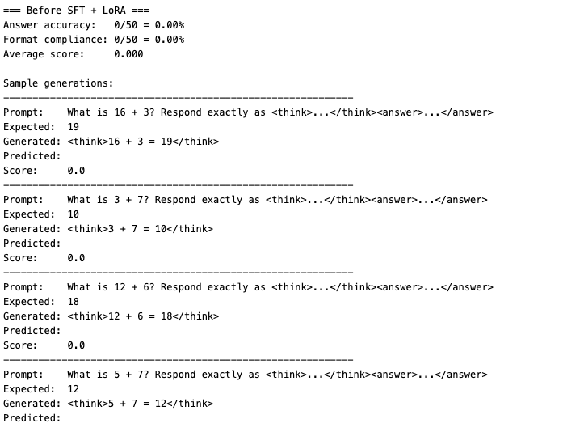|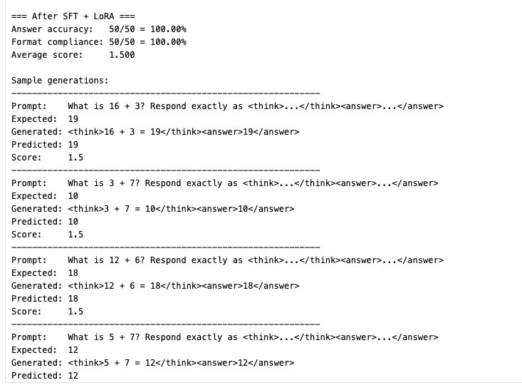|
|Qwen2.5-0.5B-Instruct|1||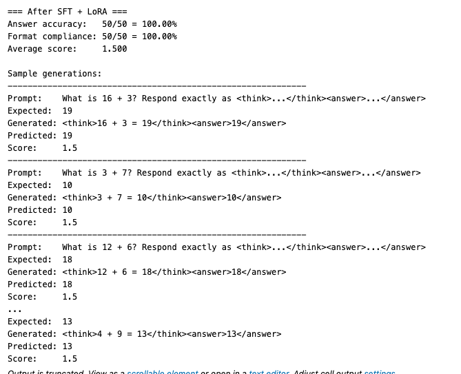|
